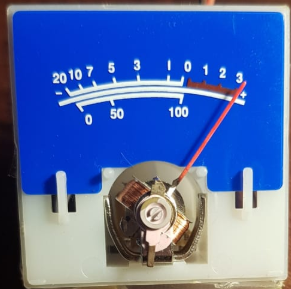
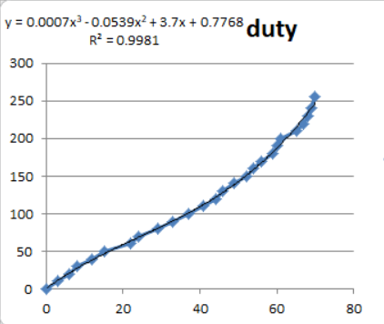

# VUMETRO_ANALOGICO
*Analisis de deflexion de aguja de vumetro analogico en funcion del duty cycle*

##Dispositivo a analizar
La siguieten iamagen el vumetro al cual se le realizo el estudio

##Limitacion de corriente
Para limitar la corriene y para utilizar al maximo la deflexion de la aguja, se utilizaron 4 resistencias en serie(3 de 2K2 y 1 de 1K).

##Relevamiento de datos
Se midio la deflexion de la aguja(en grados), en funcion al ciclo de trabajo (100% corresponde a 255). Se obtuvo la siguiente curva.

Eje horizontal, deflexion de la aguja. Eje vertical, duty (0 a  255).

A partir del programa de calculo se obtuvo la ecuacion que vincula la cantidad de grados deseados y el cyclo de trabajo a utilizar(esquina superior izquierda del grafico anterior).
